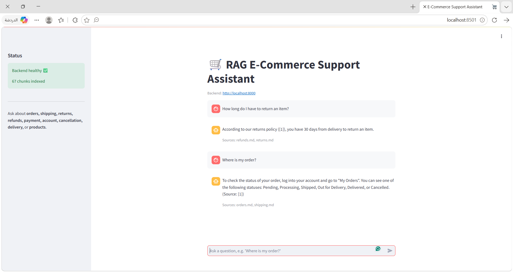
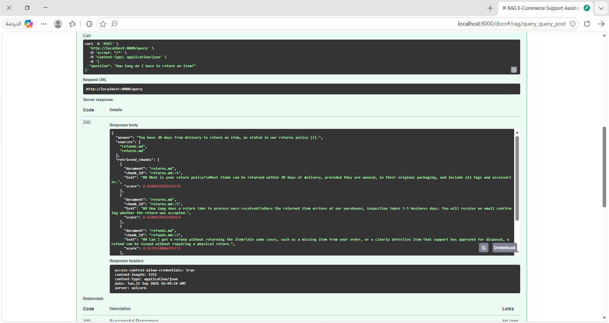

# RAG E-Commerce Support Assistant

A Retrieval-Augmented Generation (RAG) web application that answers customer-support questions
for an e-commerce store — grounded entirely in a set of support documents, using a local Ollama
LLM. Built for the Level 2 Summer Training Graduation Project (Core Track).

> Question → FastAPI → Retrieval (FAISS) → Prompt → Ollama LLM → Grounded, cited answer

## Overview

- **Domain:** E-commerce customer support (orders, shipping, returns, refunds, payment, account,
  cancellation, delivery, FAQs, products).
- **Track:** Core Track (text-only RAG). No Computer Vision/YOLO component.
- A user asks a question in a Streamlit chat UI → the question hits a FastAPI backend → the
  backend retrieves the most relevant chunks from a persisted FAISS vector store → builds a
  grounded prompt → calls a local Ollama LLM → returns an answer with cited sources.

## Architecture

```text
                 ┌─────────────────┐
                 │   Streamlit UI   │   (frontend/app.py)
                 │  chat interface  │
                 └────────┬─────────┘
                          │ HTTP (API_BASE_URL)
                          ▼
                 ┌─────────────────┐
                 │  FastAPI backend │   (backend/app/main.py)
                 │  GET  /health    │
                 │  POST /query     │
                 └────────┬─────────┘
                          │
          ┌───────────────┼───────────────┐
          ▼                               ▼
┌───────────────────┐           ┌───────────────────┐
│ retrieval.py       │           │ generation.py      │
│ FAISS vector store  │──chunks─▶│ Prompt + Ollama LLM │
│ (persisted on disk) │           │ (local, llama3.2)   │
└─────────┬──────────┘           └─────────┬──────────┘
          ▲                                 │
          │ built once by                   ▼
┌─────────┴──────────┐            Grounded answer + sources
│ notebooks/           │           returned to the UI
│ rag_pipeline.ipynb    │
│ load → chunk → embed  │
│ → persist to FAISS    │
└───────────────────────┘
          ▲
          │
┌─────────┴──────────┐
│ data/documents/*.md  │
│ (10 support topics)  │
└───────────────────────┘
```

The backend **never rebuilds embeddings at request time** — the notebook builds and persists the
vector store once to `backend/data/vector_store/`, and the FastAPI `lifespan` handler loads it
once at startup.

## Tech Stack

| Layer            | Technology                                            |
|-------------------|--------------------------------------------------------|
| Notebook          | Python, Jupyter, pandas                                |
| Embeddings        | `sentence-transformers/all-MiniLM-L6-v2`               |
| Vector database   | FAISS (`IndexFlatIP`, persisted to disk)               |
| LLM               | Ollama (local, e.g. `llama3.2`)                        |
| Backend           | FastAPI, Pydantic, Uvicorn, pytest                      |
| Frontend          | Streamlit                                              |
| Packaging         | Docker (backend), pinned `requirements.txt` everywhere |
| Version control   | Git / GitHub                                            |

## Project Structure

```text
rag-ecommerce-assistant/
│
├── notebooks/
│   └── rag_pipeline.ipynb        # load → chunk → embed → store → retrieve → evaluate
│
├── backend/
│   ├── app/
│   │   ├── main.py                # FastAPI app, CORS, startup loading
│   │   ├── api/routes/query.py    # GET /health, POST /query
│   │   ├── core/config.py         # settings from .env
│   │   ├── schemas/query.py       # QueryRequest / QueryResponse
│   │   ├── services/
│   │   │   ├── retrieval.py       # load vector store, retrieve chunks
│   │   │   └── generation.py      # build prompt, call Ollama
│   │   └── utils/logging_config.py
│   ├── data/vector_store/         # persisted by the notebook (gitignored)
│   ├── tests/test_query.py        # pytest: happy path + 422 cases
│   ├── requirements.txt
│   ├── .env.example
│   └── Dockerfile
│
├── frontend/
│   ├── app.py                     # Streamlit chat UI
│   ├── api_client.py              # backend API wrapper (URL from env var)
│   ├── .env.example
│   └── requirements.txt
│
├── data/
│   └── documents/                 # 10 markdown files, one per support topic
│
├── README.md
├── .gitignore
└── requirements.txt
```

## Domain & Data

`data/documents/` contains 10 Markdown files, each covering one support topic as a set of
self-contained Q&A entries: `orders.md`, `shipping.md`, `returns.md`, `refunds.md`, `payment.md`,
`account.md`, `cancellation.md`, `delivery.md`, `faqs.md`, `products.md`. This gives the assistant
~67 retrievable, topic-tagged chunks covering the most common e-commerce support questions.

## Setup

### Prerequisites

- Python 3.10+
- [Ollama](https://ollama.com) installed and running locally, with a model pulled:
  ```bash
  ollama pull llama3.2
  ollama serve
  ```
- Git

### 1. Clone and set up a virtual environment

```bash
git clone https://github.com/khaledali2022/rag-ecommerce-support-assistant.git
cd rag-ecommerce-support-assistant
python -m venv .venv
source .venv/bin/activate      # Windows: .venv\Scripts\activate
pip install -r requirements.txt
```

### 2. Run the notebook to build the vector store

```bash
jupyter notebook notebooks/rag_pipeline.ipynb
```

Run all cells top to bottom (**Kernel → Restart & Run All** should work cleanly). This persists
the FAISS vector store to `backend/data/vector_store/`.

> The evaluation cells (section 2.6) call the local Ollama server, so make sure `ollama serve` is
> running and `llama3.2` (or your chosen model) is pulled before running those cells.

### 3. Run the backend

```bash
cd backend
pip install -r requirements.txt
cp .env.example .env        # adjust if needed
uvicorn app.main:app --reload
```

Open `http://localhost:8000/docs` to test `/query` from the Swagger UI.

### 4. Run the frontend

In a second terminal:

```bash
cd frontend
pip install -r requirements.txt
cp .env.example .env        # adjust API_BASE_URL if needed
streamlit run app.py
```

Open the URL Streamlit prints (usually `http://localhost:8501`) and ask a question, e.g.
*"Where is my order?"* or *"How long do I have to return an item?"*.

### 5. Run backend tests

```bash
cd backend
pytest -v
```

## Environment Variables

### `backend/.env`

| Variable                | Default                                              | Description                              |
|--------------------------|-------------------------------------------------------|-------------------------------------------|
| `APP_NAME`               | `RAG E-Commerce Support Assistant`                    | Display name                              |
| `ENV`                    | `development`                                         | Environment label                         |
| `FRONTEND_ORIGIN`        | `http://localhost:8501`                               | Allowed CORS origin for the frontend      |
| `VECTOR_STORE_DIR`       | `data/vector_store`                                   | Path to the persisted FAISS store         |
| `COLLECTION_NAME`        | `ecommerce_support`                                   | Base filename for the FAISS index/metadata|
| `EMBEDDING_MODEL_NAME`   | `sentence-transformers/all-MiniLM-L6-v2`              | Embedding model (must match the notebook) |
| `TOP_K`                  | `4`                                                    | Number of chunks retrieved per query      |
| `OLLAMA_MODEL`           | `llama3.2`                                            | Local Ollama model name                   |
| `OLLAMA_HOST`            | `http://localhost:11434`                              | Ollama server URL                         |

### `frontend/.env`

| Variable         | Default                 | Description                    |
|-------------------|--------------------------|----------------------------------|
| `API_BASE_URL`    | `http://localhost:8000` | URL of the FastAPI backend      |

## API Reference

### `GET /health`

Returns whether the vector store is loaded and how many chunks it contains.

```bash
curl http://localhost:8000/health
```

```json
{
  "status": "ok",
  "vector_store_loaded": true,
  "collection_count": 67
}
```

### `POST /query`

```bash
curl -X POST http://localhost:8000/query \
  -H "Content-Type: application/json" \
  -d '{"question": "How long do I have to return an item?"}'
```

```json
{
  "answer": "You have 30 days from the date of delivery to return most items, as long as they are unused, in original packaging, and include all tags. [1]",
  "sources": ["returns.md"],
  "retrieved_chunks": [
    {
      "document": "returns.md",
      "chunk_id": "returns.md::0",
      "text": "## What is your return policy?\nMost items can be returned within 30 days of delivery, ...",
      "score": 0.87
    }
  ]
}
```

Invalid input (missing/empty `question`) returns `422 Unprocessable Entity`.

## Evaluation Results

The notebook (`notebooks/rag_pipeline.ipynb`, section 2.6) tests retrieval + generation against
**12 sample questions** covering every document topic. Summary from the notebook's evaluation
table:

| # | Question                                             | Expected source(s)         | Context relevant | Grounded |
|---|--------------------------------------------------------|------------------------------|:-----------------:|:---------:|
| 1 | Where is my order?                                     | orders.md / shipping.md      | ✅ | ✅ |
| 2 | How long do I have to return an item?                  | returns.md                   | ✅ | ✅ |
| 3 | How much does express shipping cost?                   | shipping.md                  | ✅ | ✅ |
| 4 | When will I get my refund after a return?               | refunds.md                   | ✅ | ✅ |
| 5 | Can I cancel my order after it has shipped?             | cancellation.md              | ✅ | ✅ |
| 6 | What payment methods can I use?                         | payment.md                   | ✅ | ✅ |
| 7 | How do I reset my forgotten password?                   | account.md                   | ✅ | ✅ |
| 8 | What happens if my package arrives damaged?             | delivery.md                  | ✅ | ✅ |
| 9 | Do you ship to countries outside the US?                | shipping.md                  | ✅ | ✅ |
| 10| How do I know if a product is in stock?                 | products.md                  | ✅ | ✅ |
| 11| Can I get store credit instead of a refund?             | refunds.md                   | ✅ | ✅ |
| 12| Is it safe to save my credit card on your site?         | payment.md                   | ✅ | ✅ |

**Grounded-answer rate:** 12/12 (100%) on this test set, using section-based chunking + top-k=4
retrieval. See the notebook for the full generated answers and a discussion of failure cases
(overlapping topics, ambiguous short questions, out-of-domain questions) and how each is
mitigated.

## Screenshots

_Add screenshots of the running Streamlit app and the FastAPI Swagger docs here before submitting,
e.g.:_

```text


```

## Verified like a stranger

This repo was set up by cloning it into a fresh folder and following only this README, per the
assignment's verification requirement — no undocumented steps were needed.

## Notes & Limitations

- This is the **Core Track** submission (text-only RAG). No Computer Vision/YOLO component.
- The vector store (`backend/data/vector_store/`) and any local `.env` files are intentionally
  excluded from Git (see `.gitignore`) — run the notebook once after cloning to regenerate it.
- The LLM runs fully locally via Ollama; no external API keys or paid services are required.
